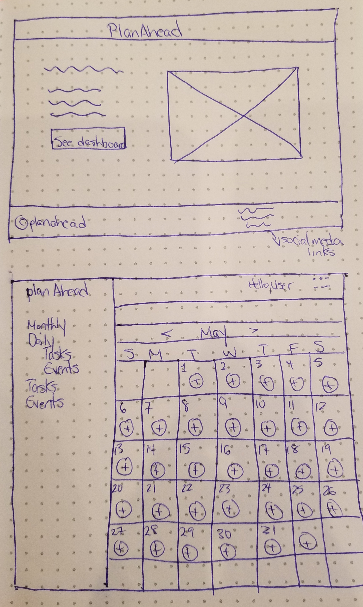
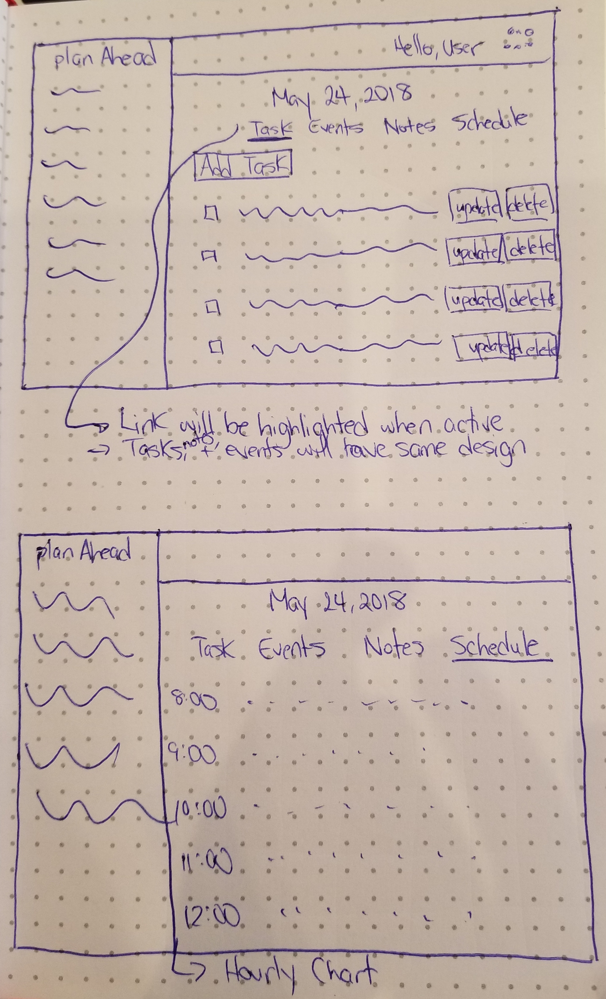

# PlanAhead

## Table of Contents

[Project Description](#project-description)  
[Wireframes](#wireframes)  
[Database Schema](#database-schema)  
[Priority Matrix](#priority-matrix)  
[User Stories](#app-components)  
[MVP](#mvp)  
[Post MVP](#post-mvp)  
[Time Estimates](#functional-components)  

## Project Description

<!-- Use this section to describe your final project and perhaps any links to relevant sites that help convey the concept and/or functionality. -->

More than ever it's critical to be organized in this fast paced society. With this app users will be able to keep track of any tasks and events they might have. With a monthly and daily view, users can easily check to see what their day will look like. You can also view upcoming appointments and a log of your daily schedule. Taking notes for your daily plans is also a feature. Users will also have the option to choose between different themes and alarm sounds for the dashboard.

- Site Example 1: https://asana.com/
- Site Example 2: https://tasks.office.com/

## Wireframes

<!-- Include images of your wireframes.  -->

## Database Schema

### Table Name: users
| Column Name | Data Type |
| --- | :---: |
| id | primary key |
| username | text not null |
| email | text not null |
| password_digest | text not null |

### Table Name: sounds
| Column Name | Data Type |
| --- | :---: |
| id | primary key |
| sound | text not null |

### Table Name: colors
| Column Name | Data Type |
| --- | :---: |
| id | primary key |
| color | text not null |

### Table Name: tasks
| Column Name | Data Type |
| --- | :---: |
| id | primary key |
| user_id | references users(id) |
| task | text not null |
| isComplete | boolean not null |

### Table Name: events
| Column Name | Data Type |
| --- | :---: |
| id | primary key |
| user_id | references users(id) |
| event | text not null |
| time | timestamp not null |
| sound | references sounds(id)

## Priority Matrix

Include a full list of features that have been prioritized based on the `Time and Importance` Matrix. 

| Component | Priority | Estimated Time |
| --- | :---: |  :---: |
| Database Setup | 1 | 2hrs|
| Page Layout | 2 | 6hrs|
| App Logic | 3 | 10hrs |
| Page Design | 4 | 9hrs|
| Auth | 5 | 1hrs| 
| Total |  | 28hrs| 

## App Components

### Landing Page
<!-- What will a user see when they start your app? -->
When the app is started users will see home page that tells them what they can do with the app, and a link to the dashboard. 

### App Initialization
<!-- What will a user see when the app is started?  -->
Once a user has entered the dashboard they will see a view of the current month with options to add events, tasks and notes to a particular day. They can also set up any upcoming appointments so they can be notified by alarm. 

### Using The App
<!-- What will a user see when the app is started?  -->
Users will be able to view their tasks and events with a monthly or daily view. They can add tasks, events and notes right on the calendar, or by going to a specific date on the calendar. Notes can include shopping lists or important details that go along with a specific task, etc. Users will be notified when an event they have added is about to start. Users will also have the option to customize their dashboard with a variety of colors. The app will be simple enough that a person of any age can feel comfortable using it as their own personal organizer. 

## MVP 
<!-- Include the full list of features that will be part of your MVP  -->
Users will be able to

* Add any tasks they must complete for a particular day
* Add important events they need to be notified of
* Take notes that they feel is important
* View and edit a daily schedule by the hour
* View tasks and events by the month or day

## POST MVP

<!-- Include the full list of features that you are considering for POST MVP -->
Have users

* Customize the look of their dashboard
* Choose between a selection of alarm sounds
* View holidays that will be coming up

## Functional Components

Based on the initial logic defined in the previous app phases section try and breakdown the logic further into functional components, and by that we mean functions. Does your logic indicate that code could be encapsulated for the purpose of reusablility.  Once a function has been defined it can then be incorporated into a class as a method. 

Time frames are also key in the development cycle.  You have limited time to code all phases of the game.  Your estimates can then be used to evalute game possibilities based on time needed and the actual time you have before game must be submitted. 

| Component | Priority | Estimated Time | Time Invested | Actual Time |
| --- | :---: |  :---: | :---: | :---: |
| Database Setup | 1 | 2hrs| 1hrs | 1hrs |
| App Logic | 2 | 6hrs| 12hrs | 12hrs |
| Page Layout | 3 | 10hrs| 6hrs | 6hrs |
| Routes | 4 | 3hrs| 2hrs | 2hrs |
| Page Design | 5 | 9hrs| 12hrs | 12hrs |
| Auth | 5 | 8hrs| 1hrs | 6hrs |
| Post-MVP | 7 | 9hrs| 1hrs | 1hrs |
| Total |  | 39hrs| 34hrs | 34hrs |
